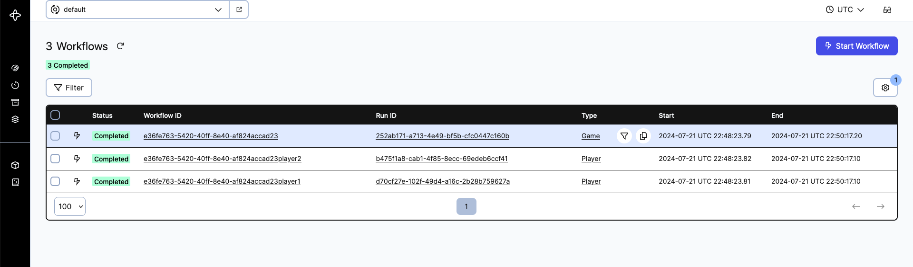
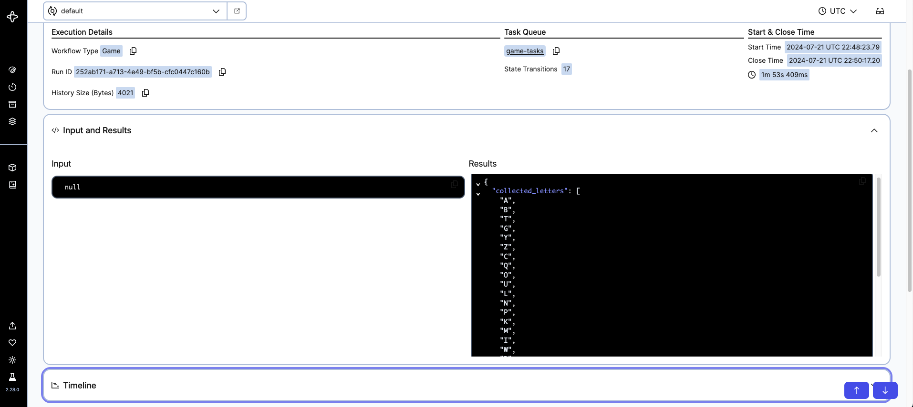

# Alphabet Battleship Challenge

The Alphabet Battleship Challenge is a submission of the [Temporal Summer Camp 2024](https://temporal.io/blog/announcing-the-temporal-summer-camp-2024-competition) 
that implements a workflow that outputs a set of alphabet letters by pitting two players against each other in a game of not-so-traditional battleship.

## Table of Contents

- [Project Description](#project-description)
- [Features](#features)
- [Requirements](#requirements)
- [Setup](#setup)
- [Usage](#usage)
- [Viewing Results](#viewing-results)

## Project Description

The Alphabet Battleship Challenge is a submission of the [Temporal Summer Camp 2024](https://temporal.io/blog/announcing-the-temporal-summer-camp-2024-competition) 
that implements a workflow that outputs a set of alphabet letters by pitting two players against each other in a game of battleship

## Features

These are the main features used from temporal:

- Child workflows (the players of the game)
- Signals (for communication between players)

## Requirements

- Temporal server
- Python

## Setup

1. **Clone the repository:**

   ```bash
   git clone https://github.com/your-username/alphabet-battleship-challenge.git
   cd alphabet-battleship-challenge
   ```

2. Create virtual environment

3. Install dependencies:

    ```
    pip install poetry
    poetry install
    ```

## Usage

All usage provided below is provided through a makefile.

1. Start Temporal server:

Follow the Temporal server documentation to set up and start the Temporal server. You can also
run the following utility provided 

```
make temporal-local
```

This will make use of the temporal command to start a local developmemnt server. 

The remaining commands use the code provided in this folder:

2. Start the Temporal workers in separate terminals:

Note: you'll need to export the variables needed for temporal in the environments 
running the worker, as such:

```
export TEMPORAL_CLUSTER_NAMESPACE=default 
export TEMPORAL_CLUSTER_HOST=localhost:7233
```


Activity terminal:

```
make player-activities-worker
```

Player workflow terminal: 

```
make player-workflow-worker
```

Game workflow terminal: 

```
make game-workflow-worker
```


3. Launch the game in an extra terminal:

```
make start-game
```


## Viewing Results

1. Access Temporal Web UI:

Open your browser and navigate to the Temporal Web UI (typically http://localhost:8233) to view the workflow execution details.

You should see 3 workflows per each execution, if you have the option to see child workflows toggled on:



2. View game workflows:
        
Search for workflows related to the Alphabet Battleship game. Once completed, access 
the game workflow results. Those will show you the winner and the sequence of letters it 
obtained when playing the battleship game!


