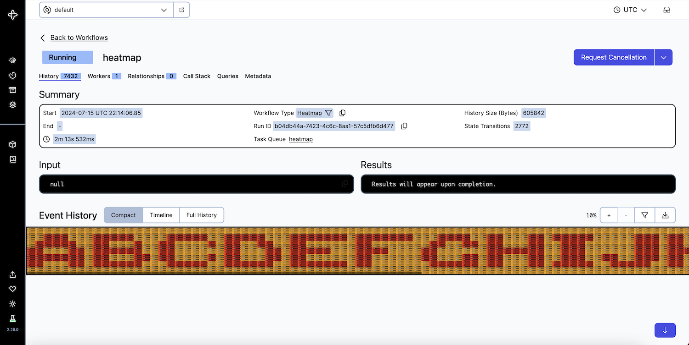

### Instructions

* `temporal server start-dev`
* `go run .`
* Open a suggested link to a Heatmap workflow execution
* Turn on [labs mode](https://docs.temporal.io/web-ui#labs-mode)
* Switch to compact event history
* Zoom out to 10% and see the letters printed on the timeline:
  

